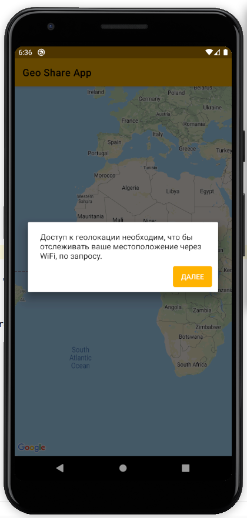

# Android permission utils


## Simple class for give multiple permissions on android device, with simple explorations. 

<a href="https://ko-fi.com/dmediadecoy"></a>
<hr>

How to:

## Gradle

### Step 1. Add the JitPack repository to your build file

```gradle
allprojects {
    repositories {
        ...
        maven { url 'https://jitpack.io' }
    }
}
```

### Step 2. Add the dependency

```gradle
dependencies {
    implementation 'com.github.dec04:PermissionUtilsLibrary:1.0'
}
```

### Basic usage:

In order for each permission to show its explanation, you need to add lines in the **_strings.xml_** file
Required format for string resource names is **PERMISSION_NAME** + **_EXPLANATION**

For example if you request this permissions (_ACCESS_FINE_LOCATION_, _ACCESS_COARSE_LOCATION_, _WRITE_EXTERNAL_STORAGE_) names must be:

```xml
<string name="ACCESS_FINE_LOCATION_EXPLANATION">Some explanation</string>
<string name="ACCESS_COARSE_LOCATION_EXPLANATION">Some explanation</string>
<string name="WRITE_EXTERNAL_STORAGE_EXPLANATION">Some explanation</string>
```

Code from my google map example:

```java
Context applicationContext;
PermissionUtils permissionUtils;
String[] permissions = {
    Manifest.permission.ACCESS_FINE_LOCATION,
    Manifest.permission.ACCESS_COARSE_LOCATION,
    Manifest.permission.WRITE_EXTERNAL_STORAGE
};
```

Usually in a method OnCreate:

```java
applicationContext = GoogleMapActivity.this;
permissionUtils = new PermissionUtils(applicationContext);
```

Check permissions:

```java
// ... some code ...

// Check all permissions
if (permissionUtils.check(permissions)) {
    // if permissions already taken
    // do something
} else {
    // request permission
    permissionUtils.requestPermission(permissions);
}
```

If permission not taken, app request it from user. All at once.

 

Usualy in OnResume or OnResumeFragment method:

```java
if (permissionUtils.flagPermissionDenied) {
    // Permission was not granted, display "permission rejected" dialog.
    permissionUtils.showMissingPermissionError(permissions);
    permissionUtils.flagPermissionDenied = false;
}
```

Now, if user reject permission app show window, explaining that the permit is not received.


The next time you request permissions, a window will be displayed explaining why you need each permission individually. In the last window, you can re-request permission.



You also need implement method onRequestPermissionsResult

```java
@Override
public void onRequestPermissionsResult(int requestCode, @NonNull String[] permissions, @NonNull int[] grantResults) {
    if (requestCode != PERMISSION_REQUEST_CODE) {
        return;
    }

    if (permissions.length != 0) {
        if (!permissionUtils.check(permissions)) {
            // Display the missing permission error dialog when the fragments resume.
            permissionUtils.flagPermissionDenied = true;
        } else {
            // For example enable the "my location layer" if the permission has been granted.
        }
    }
}
```

That's all. Happy hacking. :heart_decoration:

